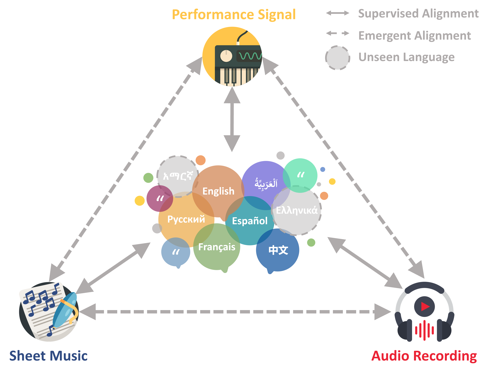

# **CLaMP 3: Universal Music Information Retrieval Across Unaligned Modalities and Unseen Languages**
[](https://sanderwood.github.io/clamp3/)
[](https://arxiv.org/abs/2502.10362)
[](https://github.com/sanderwood/clamp3)
[](https://huggingface.co/spaces/sander-wood/clamp3)
[](https://huggingface.co/sander-wood/clamp3/tree/main)
[](https://huggingface.co/datasets/sander-wood/m4-rag)
[](https://huggingface.co/datasets/sander-wood/wikimt-x)

<p align="center">
  
</p>

## **Overview**
CLaMP 3 is a **state-of-the-art** framework for **music information retrieval (MIR)** across multiple **modalities** (✍️ **text**, 🎼 **sheet music**, 🎵 **audio**, 🎹 **MIDI**, and 🖼️ **images**) and **languages** (🌐 27 trained, 100 supported). It leverages **contrastive learning** to align diverse music modalities into a **shared representation space**, enabling seamless cross-modal retrieval. You can think of it as a more comprehensive version of CLAP or MuLan—with much stronger performance, support for all major music modalities, and global language coverage.

🚀 **Why CLaMP 3?**  
✅ **Multimodal**: Works with ✍️ **text**, 🎼 **sheet music**, 🎵 **audio**, 🎹 **MIDI**, and 🖼️ **images**  
✅ **Multilingual**: Supports **27 trained** & generalizes to **100 languages**  
✅ **SOTA Performance**: Significantly outperforms previous strong baselines across modalities and languages

## ✨ **Key Features**  

### **Multimodal Support**  
- **Sheet Music**: Interleaved ABC notation (**512 bars**)  
- **Performance Signals**: MIDI Text Format (**512 MIDI messages**)  
- **Audio Recordings**: [MERT](https://arxiv.org/abs/2306.00107) features (**640 sec of audio**)  

### **Multilingual Capabilities**  
- Trained on **27 languages**, generalizes to **100 languages** using [XLM-R](https://arxiv.org/abs/1911.02116)  

### **Visual Semantic Understanding**  
- Learns visual semantics (e.g., image captions) for tasks like **image-to-music retrieval** 

### **Datasets & Benchmarks**  
- **[M4-RAG](https://huggingface.co/datasets/sander-wood/m4-rag)**: **2.31M music-text pairs** 🌎  
- **[WikiMT-X](https://huggingface.co/datasets/sander-wood/wikimt-x)**: **1,000 music triplets**  

## 🔥 **What Can CLaMP 3 Do?**  

💡 **Text-to-Music Retrieval**: Search music with text (100 languages!)  
📸 **Image-to-Music Retrieval**: Match music to images 🎨  
🔄 **Cross-Modal Retrieval**: Find related music across different modalities  
🛠️ **Zero-Shot Classification**: Identify genre, mood, style, & more 🏷️  
🎼 **Semantic Similarity**: Measure semantic similarity between generated & reference music  

👉 **Check it out**: [CLaMP 3 Homepage](https://sanderwood.github.io/clamp3/)  

## **Quick Start Guide**  
For users who want to get started quickly with CLaMP3, follow these steps:

### **Install the Environment**  
Run the following commands:

```bash
conda create -n clamp3 python=3.10.16 -y
conda activate clamp3
conda install pytorch torchvision torchaudio pytorch-cuda=11.8 -c pytorch -c nvidia -y
pip install -r requirements.txt
```

### **Overview of `clamp3_*.py` Scripts**  
CLaMP 3 provides scripts for **semantic similarity calculation**, **semantic search**, and **retrieval performance evaluation** across five modalities. Simply provide the file path, and the script will automatically detect the modality and extract the relevant features.

Supported formats include:
- **Audio**: `.mp3`, `.wav`
- **Performance Signals**: `.mid`, `.midi`
- **Sheet Music**: `.mxl`, `.musicxml`, `.xml`
- **Images**: `.png`, `.jpg`
- **Text**: `.txt` (in 100 language)

#### **Feature Management**  
- Extracted features are stored in the `cache/` directory and reused in future runs to avoid recomputation.
- Temporary files are saved in `temp/` and cleaned up after each run.

> **Note**: All files in a folder must belong to the same modality for processing.

#### **[`clamp3_score.py`](https://github.com/sanderwood/clamp3/blob/main/clamp3_score.py) - Semantic Similarity Calculation**

This script calculates semantic similarity between query and reference files. By default, it uses **pairwise mode**, but you can switch to **group mode** using the `--group` flag.

```bash
python clamp3_score.py <query_dir> <ref_dir> [--group]
```

- **Pairwise Mode (default)**:  
  Compares files with **matching prefixes** and **identical folder structures**.

  **Folder structure example**:
  ```
  query_dir/
  ├── en/
  │   ├── sample1.wav  
  ├── zh/
  │   ├── sample1.1.wav   
  │   ├── sample1.2.wav    
  │   ├── sample2.wav  

  ref_dir/
  ├── en/
  │   ├── sample1.txt
  ├── zh/
  │   ├── sample1.txt
  │   ├── sample2.txt
  ```

  - Files with the **same prefix** (before the first dot) are treated as pairs (e.g., `query_dir/en/sample1.wav` and `ref_dir/en/sample1.txt`).
  - Multiple query files (e.g., `query_dir/zh/sample1.1.wav`, `query_dir/zh/sample1.2.wav`) can correspond to one reference file (e.g., `ref_dir/zh/sample1.txt`).

  **Important**:  
  - **Pairwise mode** can be **slow** for large datasets.  
  - If you have a large dataset, **switch to group mode** for faster computation.

- **Group Mode**:  
  Compares **all query files** to **all reference files** and calculates the average similarity.

  **Enable Group Mode**:
  ```bash
  python clamp3_score.py query_dir ref_dir --group
  ```

#### **[`clamp3_search.py`](https://github.com/sanderwood/clamp3/blob/main/clamp3_search.py) - Semantic Search**  

Run retrieval tasks by comparing a query file to reference files in `ref_dir`. The query and `ref_dir` can be **any modality**, so there are **25 possible retrieval combinations**, e.g., text-to-music, image-to-text, music-to-music, music-to-text (zero-shot music classification), etc.

```bash
python clamp3_search.py <query_file> <ref_dir> [--top_k TOP_K]
```

#### **[`clamp3_eval.py`](https://github.com/sanderwood/clamp3/blob/main/clamp3_eval.py) - Retrieval Performance Evaluation**  

Evaluates **CLaMP3's retrieval performance** on a paired dataset using metrics like **MRR** and **Hit@K**. Works the same way as **pairwise mode** in `clamp3_score.py`—requiring **matching folder structure** and **filenames** between `query_dir` and `ref_dir`.

```bash
python clamp3_eval.py <query_dir> <ref_dir>
```

## **Repository Structure**
- **[code/](https://github.com/sanderwood/clamp3/tree/main/code)** → Training & feature extraction scripts.
- **[classification/](https://github.com/sanderwood/clamp3/tree/main/classification)** → Linear classification training and prediction.  
- **[inference/](https://github.com/sanderwood/clamp3/tree/main/inference)** → Semantic search, similarity calculations, and retrieval evaluation.  
- **[preprocessing/](https://github.com/sanderwood/clamp3/tree/main/preprocessing)** → Convert data into Interleaved ABC, MTF, or MERT-extracted features.  

> **Note:** Ensure the model weights are placed in the `code/` folder, and verify the configuration hyperparameters before use.

## **Key Script Overview**
### **Data Preparation**
#### **1. Convert Music Data to Compatible Formats**
Before using CLaMP 3, preprocess **MusicXML files** into **Interleaved ABC**, **MIDI files** into **MTF**, and **audio files** into **MERT-extracted features**.

##### **1.1 Convert MusicXML to Interleaved ABC Notation**  

CLaMP 3 requires **Interleaved ABC notation** for sheet music. Follow these steps:

1. Convert **MusicXML** (`.mxl`, `.xml`, `.musicxml`) to **standard ABC** using [`batch_xml2abc.py`](https://github.com/sanderwood/clamp3/blob/main/preprocessing/abc/batch_xml2abc.py):  
   ```bash
   python batch_xml2abc.py <input_dir> <output_dir>
   ```
   - **Input:** Directory containing `.mxl`, `.xml`, `.musicxml` files  
   - **Output:** Directory where converted `.abc` (Standard ABC) files will be saved  

2. Convert **Standard ABC** into **Interleaved ABC** using [`batch_interleaved_abc.py`](https://github.com/sanderwood/clamp3/blob/main/preprocessing/abc/batch_interleaved_abc.py):  
   ```bash
   python batch_interleaved_abc.py <input_dir> <output_dir>
   ```
   - **Input:** Directory containing `.abc` (Standard ABC) files  
   - **Output:** Directory where Interleaved ABC files will be saved *(for CLaMP 3 use)*  

##### **1.2 Convert MIDI to MTF Format**  

CLaMP 3 processes performance signals in **MIDI Text Format (MTF)**. Convert **MIDI files** (`.mid`, `.midi`) into **MTF format** using [`batch_midi2mtf.py`](https://github.com/sanderwood/clamp3/blob/main/preprocessing/midi/batch_midi2mtf.py):  
```bash
python batch_midi2mtf.py <input_dir> <output_dir> --m3_compatible
```
- **Input:** Directory containing `.mid`, `.midi` files  
- **Output:** Directory where `.mtf` files will be saved *(MTF format for CLaMP 3)*  
- **Important:** The `--m3_compatible` flag **must be included** to ensure the output format is compatible with CLaMP 3. Without this flag, the extracted MTF files **will not work** correctly in the pipeline.

##### **1.3 Extract Audio Features using MERT**
For audio processing, CLaMP 3 uses **MERT-extracted features** instead of raw waveforms. Extract MERT-based features from raw audio (`.mp3`, `.wav`) using [`extract_mert.py`](https://github.com/sanderwood/clamp3/blob/main/preprocessing/audio/extract_mert.py):

```bash
python extract_mert.py --input_path <input_path> --output_path <output_path> --model_path m-a-p/MERT-v1-95M --mean_features
```
- **Input:** `.mp3`, `.wav`  
- **Output:** `.npy` *(Processed audio features for CLaMP 3)*  

### **Training and Feature Extraction**  

#### **1. Training Models**  
CLaMP 3 is the most powerful music retrieval model, and in most cases, retraining is not needed. However, if necessary, follow these steps.  

1. Modify **[config.py](https://github.com/sanderwood/clamp3/blob/main/code/config.py)** to adjust **hyperparameters** and **data paths**.  

2. Train on your own data.

To train CLaMP 3 on **symbolic music** (e.g., sheet music, MIDI), run:  
```bash
python -m torch.distributed.launch --nproc_per_node=<GPUs> --use_env train_clamp3_symbolic.py
```
For **audio data**, use:  
```bash
python -m torch.distributed.launch --nproc_per_node=<GPUs> --use_env train_clamp3_audio.py
```

##### **Using Pre-Trained Models (Recommended)**  
For most use cases, it's best to use pre-trained weights instead of training from scratch.  

| Version | Best for | Download Link |
|---------|---------|--------------|
| **CLaMP 3 SAAS** | **Audio-based retrieval (Recommended)** | [Download SAAS](https://huggingface.co/sander-wood/clamp3/blob/main/weights_clamp3_saas_h_size_768_t_model_FacebookAI_xlm-roberta-base_t_length_128_a_size_768_a_layers_12_a_length_128_s_size_768_s_layers_12_p_size_64_p_length_512.pth) |
| **CLaMP 3 C2** | **Symbolic music retrieval (Sheet music, MIDI)** | [Download C2](https://huggingface.co/sander-wood/clamp3/blob/main/weights_clamp3_c2_h_size_768_t_model_FacebookAI_xlm-roberta-base_t_length_128_a_size_768_a_layers_12_a_length_128_s_size_768_s_layers_12_p_size_64_p_length_512.pth) |

##### **How to Switch Between Versions?**  
By default, CLaMP 3 is configured for the **SAAS version** (optimized for audio).  
- If working with **symbolic music (MIDI, sheet music)**, use the **C2 version**:  
  **Modify line 66 in `config.py`** from `"saas"` to `"c2"`.
  
#### **2. Feature Extraction**
After training (or using pre-trained weights), extract features using [`extract_clamp3.py`](https://github.com/sanderwood/clamp3/blob/main/code/extract_clamp3.py):

```bash
accelerate launch extract_clamp3.py --epoch <epoch> <input_dir> <output_dir> --get_global
```
- **`--epoch <epoch>`:** (Optional) Specify the checkpoint epoch.  
- **`<input_dir>`:** Directory containing the input files.  
- **`<output_dir>`:** Destination folder for the output `.npy` features.  
- **`--get_global`**: **(Required for retrieval!)** Extracts a **global semantic vector** for each input.  

All extracted features are stored as `.npy` files.

> **Note**: For retrieval, `--get_global` must be used. Without it, CLaMP 3 will not work correctly for retrieval tasks. You only omit `--get_global` if you are performing downstream fine-tuning or need raw feature extraction for custom tasks.

## **Citation**
If you find CLaMP 3 useful in your work, please consider citing our paper:

```bibtex
@misc{wu2025clamp3universalmusic,
  title={CLaMP 3: Universal Music Information Retrieval Across Unaligned Modalities and Unseen Languages}, 
  author={Shangda Wu and Zhancheng Guo and Ruibin Yuan and Junyan Jiang and Seungheon Doh and Gus Xia and Juhan Nam and Xiaobing Li and Feng Yu and Maosong Sun},
  year={2025},
  eprint={2502.10362},
  archivePrefix={arXiv},
  primaryClass={cs.SD},
  url={https://arxiv.org/abs/2502.10362}
}
```